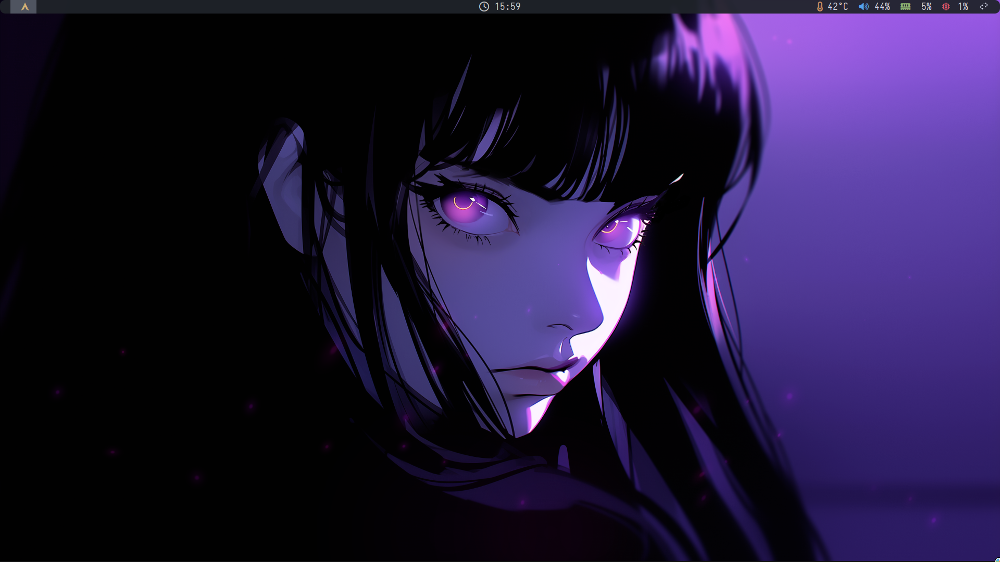
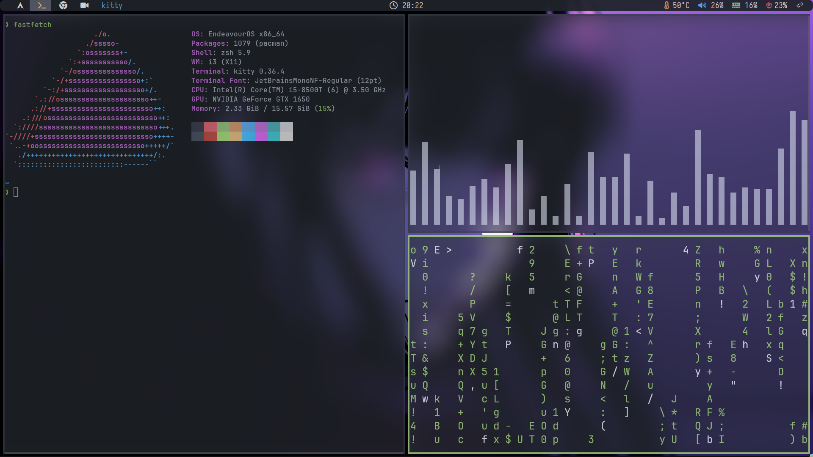

# My Arch Linux Setup

>I will continue to update it little by little

---

## Chapters

- [Images](#images)
- [Requirements](#requirements)
- [Installation](#installation-begins)
- [Post-Installation](#booting-into-endeavour-os)
    - [Running the Script](#running-the-script)


# Images

<table align="center">
    <tr>
        <td>
            
        </td>
        <td>
            
        </td>
    </tr>
</table>

# Requirements

- [Endeavour OS ISO File](https://endeavouros.com/)
- ( USB ) Flash Drive
- Software to *burn* the ISO File to Flash Drive
	- [rufus](https://rufus.ie/en/)
	- [balena-etcher](https://github.com/balena-io/etcher)
- Internet Connection

>[!NOTE]
>The whole thing ( _including things that does is **not** present in install script_ ) should take around 1 hour to completely setup Arch Linux.
>
>I did it around, in like what? 15 to 25 mins just for the installation process; not including things like:
>
>- Signing into applications
>- Setting up DNS
>- ...
>

# Installation Begins

>[!TIP] Initial Steps
>
>>BTW I know these; just for people you have never done this stuff!
>
>1. Plug in your bootable USB Flash Drive in you... Sorry I mean your computer
>2. Enter your BIOS with your required key $\Rightarrow$ `F2`, `F12`, `DEL`, etc
>3. Select your USB Flash Drive
>
>Normally in the BIOS, that USB Flash Drive will appear as 'USB: UEFI' or something along those lines.
>

## Booting Up Into Endeavour OS

You are going to see a black screen asking you to select an option to enter in the "*live*" environment.

>[!WARNING]
>Don't press `Enter` like a mad-man! I think you have to select the **second** option if you are using [Nvidia](https://www.nvidia.com/en-us/) GPUs. Hence, always **read** first, then you proceed!
>
>In addition, whichever option you select, the *steps* below $\downarrow$ will still be the **same**.

Currently, Endeavour OS uses the [KDE Plasma](https://kde.org/plasma-desktop/) Desktop Environment for its "*live boot*". It should be similar to something like Windows, where you have a taskbar at the bottom.

>[!TIP] What I Like to Do
>One of the things I like to do is to change the mirrors ( 'Update Mirrors (Arch, reflector-simple)' *setting* ).
>Normally, the installer will detect your country. Thus, it will already *check* your country.
>I also like to *check* the 'Worldwide' box; *because I fucking can*!!!
>
>I also like to hit the 'Update Mirrors (Arch, rate-mirrors)' and 'Update Mirrors (Endeavour OS)' just to make sure that everything is up-to-date!
>
>>If you **don't** what "*a*" settings does... **Leave it Default**!!!
>

Finally, I start the [Calamares](https://github.com/calamares/calamares) installer and simply go through the process.

#### Selecting Desktop Environment and Packages

##### Desktop Environment

Well, the main reason why I like Linux so much are fucking is because of **Tiling Window Managers**. Man, people who have never used a Tiling Window Manager don't know the pain that they are going through... *I am looking at you Mac OS users*.

>I mean Mac OS doesn't even have a snapping feature by default!

I am currently using the [i3](https://i3wm.org/) window manager with / on [X11](https://en.wikipedia.org/wiki/X_Window_System).
Hence, **select** 'i3' and proceed to the package configuration

>But I do plan to switch to [Hyprland](https://hyprland.org/) with / on [Wayland](https://wayland.freedesktop.org/) in the near future!

##### Packages

Endeavour OS comes pre-installed with many packages. This help the user to basically use their distribution without *much* configuration needed. This is great, but we are going to remove / *uncheck* some of those packages.

>[!TIP] Packages that **Needs** to be Removed
>- Desktop-Base + Common packages
>	- Fonts
>		- canterall-fonts
>		- freetype2
>		- all 'noto-fonts' **except** 'noto-fonts-emoji'
>		- ttf-liberation
>- EndeavourOS Applications
>	- Remove **all** of them
>- Recommended applications selection
>	- nano-syntax-highlighting ( *I use VIM BTW* )
>	- tldr
>	- inxi
>	- hwinfo ( *seems fun though* )
>	- glances ( *we have `btop` for that* )
>	- pv ( *never used this nor will I use it* )
>	- meld ( *seems cool though* )
>- Firefox and language package
>	- Remove **all** of them
>- i3-Window-Manager
>	- Xed ( *we have sublime text for that ---> leave it if you want* )
>	- unzip ( *we have p7zip for that* )
>	- scrot ( *we are using `maim`* )
>	- jq ( *I don't really work with `.json` files... cough, cough* )
>	- endeavouros-xfce4-terminal-colors
>	- dunst ( *you could keep it* )

#### Selecting Bootloader

Normally, we have 3 options; 'systemd' *thing*, 'grub' and *no bootloader*.

If you don't have the option of 'systemd', **select it**.

>When I was beginning my Linux "*career*" ( *if that's even a thing* ). I used to use 'grub'.
>I got a lot of problems with 'grub'.

#### To Swap or To Not Swap

>That is the question $\uparrow$

Nowadays with the ["*Powweerrr*"](https://www.youtube.com/watch?v=4n91tUoUWSo) that we have; it's not really necessary to make a "*swap*" partition.

Hence, just select `ext4` as your partition type and continue.

>[!SUCCESS] Install Endeavour OS
>After that, it will give you a summary of what options and configuration that you are going to use.

## Booting into Endeavour OS

After restarting ( *I hope that you removed the Flash Drive* ), you will be greeted by *LightDM* at the login screen.

After login, you are going to see something like this $\downarrow$:


## Clone Repository

Go ahead and open the default 'xfce4-terminal' in which you are going to **clone** this very repository like so $\downarrow$:

```bash
git clone https://github.com/Sunhaloo/dotfiles
```

Running the command will clone my dotfiles repository into your machine. If you type the command `ls | grep dotfiles`; you are going to a folder named... *dotfiles*!

After that, follow the code block below $\downarrow$:

```bash
cd dotfiles/scripts; ./install.sh
```

What this $\uparrow$ does; it will go into the folder `dotfiles`, then into `scripts` and finally **run** the *install* script.

### Running the Script

Well, you are going to have 4 options... Mainly 3 options, because the last one is exiting the script ( *I swear this is handy* ).

Well, now that I am realising; I could have made the install script run without any supervision, instead of the user ( *primarily me* ) typing the option that they want to choose.

>Ohh well!

>[!TIP] Steps to using the Script
>1. Choose Option '1'
>2. Choose Option '2'
>3. Choose Option '3'

>Well, you should be good!

>[!WARNING] Warning! Warning! Warning!
>**Don't Choose Option 3 Again!!!**
>
>I made a *shittier* script than this in the beginning.
>Therefore, I passed that "*shittier*" script to [ChatGPT](https://chat.openai.com)!
>It then provided me with a "*shit*" script instead of a "*shittier*" one!
>
>Well, choosing option '1' and '2', will **not** cause any harm. Because they are just updating and installing application and ChatGPT provided a code that if it founds that package ( *that is already installed* ); it will simply provide a message instead of re-installing it.
>
>But its a different story with option number '3'. **It's going to delete folders**...
>Hence, simply **don't run the whole script again**!

# Why Use Endeavour OS

I always wanted to use vanilla arch!

When I was testing for the install script to work on a vanilla arch; which I installed on laptop ( bare metal ). I had a lot of inconvenience; like the folders 'Desktop', 'Downloads', 'Music' and more was not even here!

The **main** reason for using Endeavour is that its a time saver!

Like in the installation, [yay](https://github.com/Jguer/yay) is already installed!
In addition, somethings like the Arc ( Dark ) theme which I really like is already configured!

But its not like its really bloated of anything, its light ( *depending on the packages you select* ), but its light. For my coding and browsing needs, I does everything that I throw at it.

>[!TIP] Again
>The main reason that I use Linux are:
>
>1. ( Better ) Package Managers ( *I know that [winget](https://en.wikipedia.org/wiki/Windows_Package_Manager) exist* )
>2. Window Manager ( *like actual Tiling Window Managers* )
>3. I makes me a better Windows User...
>	- Instead of installing things using a browser; just use `winget`
>	- Commends like `cat`, `grep` are just `Get-Content`, `FindStr` and much more
>

---

>[!NOTE]
>If you have any problems or some improvement that you can make the make the script better.
>Please, Please feel free to contact me using these contacts below $\downarrow$:
>
>- **Instagram**: https://www.instagram.com/s.sunhaloo
>- **YouTube**: https://www.youtube.com/channel/UCMkQZsuW6eHMhdUObLPSpwg
>- **GitHub**: https://www.github.com/Sunhaloo
> 

---

S.Sunhaloo
Thank You!
