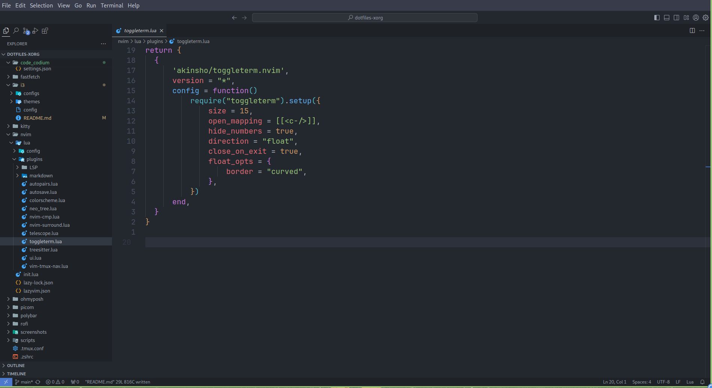
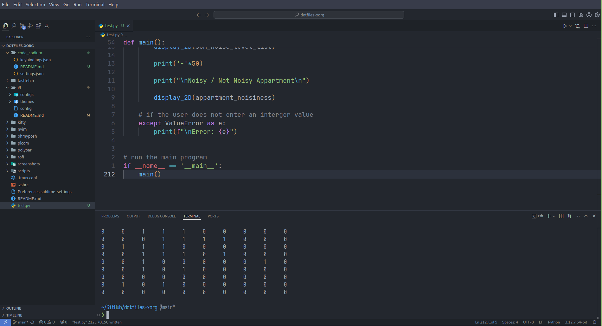

# VS Code / VS Codium Setup

>Simple VS Code / Codium Configuration

<table align="center">
    <tr>
        <td>
            
        </td>
        <td>
            
        </td>
    </tr>
</table>

>[!WARNING]
>The 2 green lines are part of my i3 configuration and has nothing to do with VS Code / VS Codium.

# Extensions

- [Vim](https://github.com/VSCodeVim/Vim)
- [One Dark Pro](https://github.com/Binaryify/OneDark-Pro)
- [Material Icon Theme](https://github.com/material-extensions/vscode-material-icon-theme)
- [Python](https://github.com/Microsoft/vscode-python) $\rightarrow$ _The Extension **Pack** One_!

>[!NOTE]
>I normally use Neovim and pretty much stays in the terminal for most things.
>But I do use VS Codium from time to time.
>
>Hence, this will basically stay as an "*work-in-progress*" and will always be incomplete
>
>>Nevertheless, if I do add something to it; I will update it!
>
>>Additionally, as VS Code it the standard code editor for most applications / companies;
>>There are plenty of tutorials online on how to configure it!
