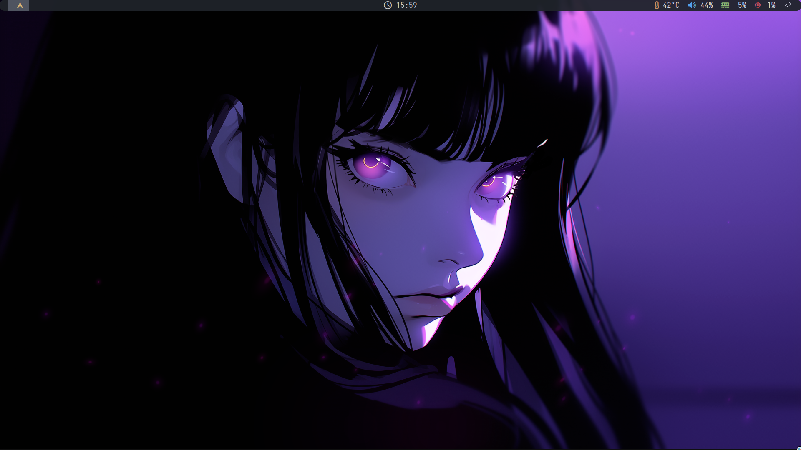
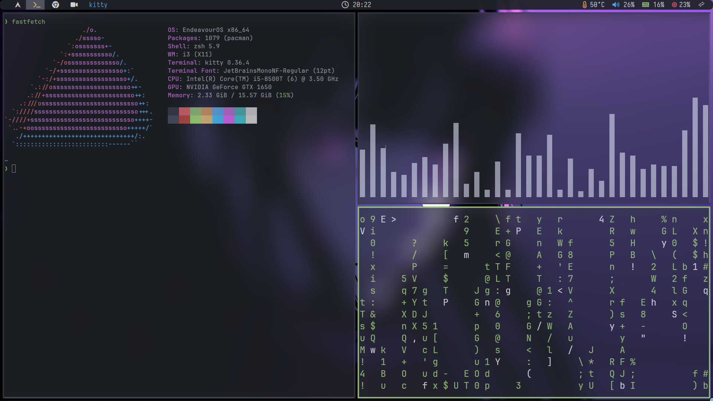

# i3 Window Manager Setup

<table align="center">
    <tr>
        <td>
            
        </td>
        <td>
            
        </td>
    </tr>
</table>

---

## Dependencies

### i3 System / Desktop Related

- [Nerd Font](https://www.nerdfonts.com/font-downloads) $\rightarrow$ For icons
    - Iosevka Nerd Font
    - Jet Brains Nerd Font
    - Victor Mono Nerd Font
- [LXInput](https://github.com/lxde/lxinput) $\rightarrow$ Mouse and Keyboard Configuration
- [feh](https://github.com/derf/feh) $\rightarrow$ Wallpaper ( sets images as desktop wallpaper )
- [autotiling](https://github.com/nwg-piotr/autotiling) $\rightarrow$ Autotiling for i3 / Sway
- [polybar](https://github.com/polybar/polybar) $\rightarrow$ An alternative to i3blocks
- [picom](https://github.com/yshui/picom) $\rightarrow$ Adds transparency, blur, and rounded corners
- [maim](https://github.com/naelstrof/maim) $\rightarrow$ Screenshot Tool
- [xclip](https://github.com/astrand/xclip) $\rightarrow$ X11 Clipboard

### Programs

- [Rofi](https://github.com/davatorium/rofi) $\rightarrow$ Application Launcher
    - [rofi-emoji](https://github.com/Mange/rofi-emoji) $\rightarrow$ Emoji Selector for Rofi
- [Kitty](https://github.com/kovidgoyal/kitty) $\rightarrow$ Terminal Emulator
- [VS Codium](https://github.com/VSCodium/vscodium) $\rigtharrow$ IDE
- [Thorium](https://github.com/Alex313031/thorium) $\rightarrow$ Web Browser
- [Thunar](https://wiki.archlinux.org/title/Thunar) $\rightarrow$ File Manager

>[!NOTE]
>Ensure these folders / directories are set up.
>
>- `~/Screenshots/`
>- `~/Wallpapers/`
>
>These will be the location where screenshots are saved
>>Check i3 configuration `config` file if you want to change it